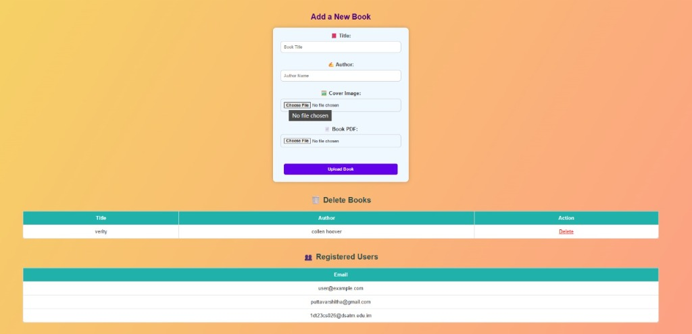
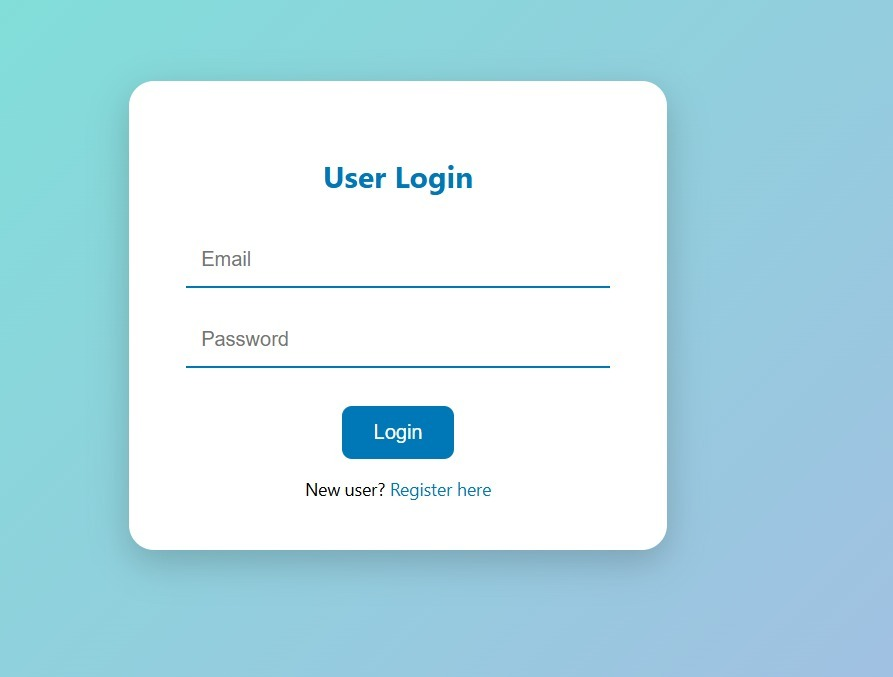
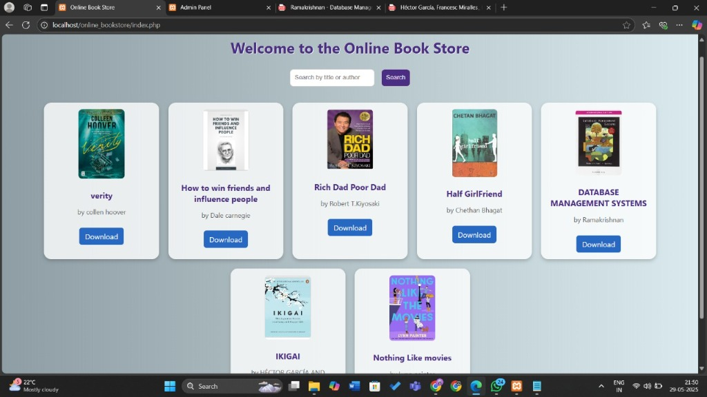

ONLINE BOOKSTORE PROJECT (PHP + MySQL + XAMPP)
====================================================

1. Setup Instructions:
   - Install XAMPP from https://www.apachefriends.org/
   - Place this project folder into the XAMPP 'htdocs' directory.
   - Start Apache and MySQL from the XAMPP control panel.

2. Database Setup:
   - Open phpMyAdmin at http://localhost/phpmyadmin
   - Create a database named: bookstore
   - Import the 'bookstore.sql' file (you can create this based on your table structure).

3. Access Website:
   - Go to http://localhost/online_bookstore/login.php

4. Admin Panel:
   - Visit: http://localhost/online_bookstore/admin_login.php
   - Email: admin@example.com
   - Password: admin123

5. GitHub Repository:
   - https://github.com/Akshaya0026/online_book_store.git

## Screenshots

